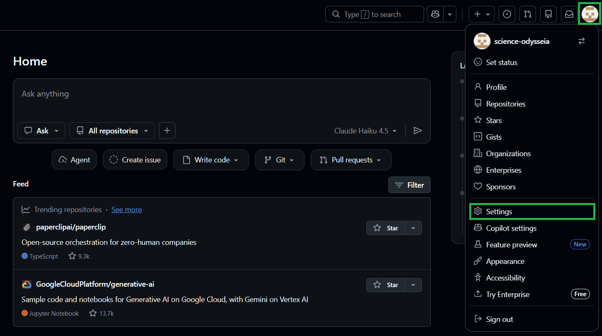
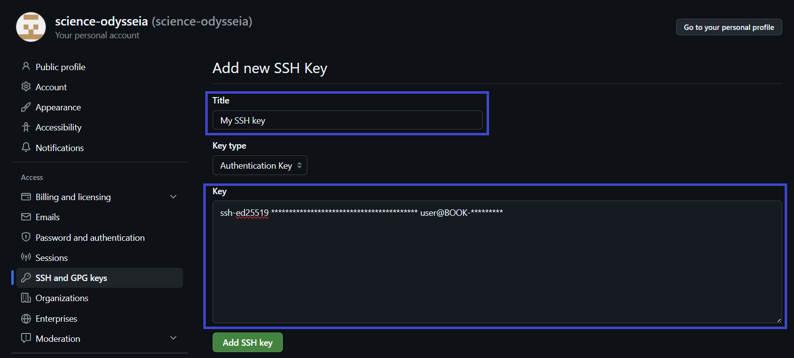
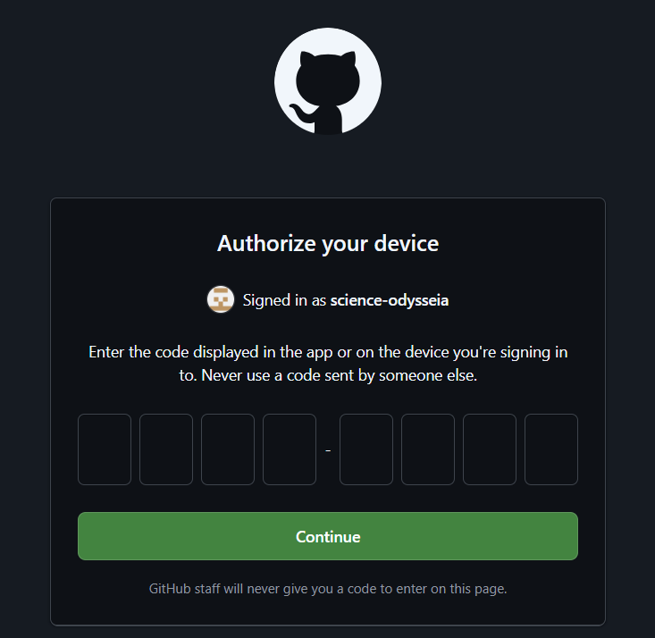

# Git Settings
Git 처음 배우는 사람을 위해....(사실 본인도 잘 몰라요... 안까먹으려고 작성한 문서)

## 1. Github 회원가입 / 로그인
1. https://github.com 접속 (이걸 보고 있다면 이미 접속했겠지만......)
2. 계정이 없다면 'Sign up'으로 회원가입, 있다면 Sign in'으로 로그인

|||
|---|---|

3. Username과 Email은 기억하세요. 나중에 쓰입니다.


## 2. Git 설치
### PS(PowerShell) 버전(Windows)

PowerShell이 없는 경우 Microsoft Store 앱에서 다운받아서 설치할 수 있습니다.

winget을 이용하여 설치해보겠습니다.

1. 우선 winget이 이미 있는지 확인

``` powershell
winget --version
```

아래 형식이 나오면 설치된 것.

    v0.00.000

만약 없다면

``` powershell
Invoke-WebRequest -Uri "https://aka.ms/Microsoft.DesktopAppInstaller_8wekyb3d8bbwe.msixbundle" -OutFile "$env:TEMP\AppInstaller.msixbundle"
Add-AppxPackage -Path "$env:TEMP\AppInstaller.msixbundle"
```

실행 후 ps 종료 후 재시작. 

2. 설치 시작

``` powershell
winget install --id Git.Git -e --source winget
```

**실행 후 반드시 PS를 종료 후 재시작해주세요. 안 그러면 여전히 에러납니다.**


설치가 제대로 되었는지 확인해봅시다.

``` powershell
git --version
```

버전이 나타나면 설치성공.

3. 사용자 정보 설정

아래 명령어를 입력합니다. "" 안에 있는 내용은 본인이 원하는대로 쓰시면 됩니다.

자유롭게 입력하셔도 무방합니다만 되도록이면 본인의 github 계정에 맞게 쓰시는 걸 권장드립니다.

``` powershell
git config --global user.name "당신의 닉네임"
git config --global user.email "당신의 이메일(xxxx@xxxxx.com 형식)"
```

아래 명령어로 확인

``` powershell
git config user.name
git config user.email
```

## 3. Repository(레포지토리) 생성
Repository(레포지토리)란?

그냥 간단히 Git 저장소에 올릴 대표 저장 폴더 정도로 생각하면 됩니다.

github.com에서 직접 추가해도 되지만

터미널을 이용해서 추가해 볼 예정입니다.

### Github-CLI 설치
터미널에서 작업을 하기 위해선 먼저 Github-CLI를 설치해야합니다.

그 전에 레포지토리로 사용할 폴더를 만들어주세요.

여기선 'MyProject'로 해보겠습니다.


``` powershell
# 현재 경로 아래에 MyProject 생성
mkdir MyProject

# 해당 폴더로 이동
cd MyProject

# git 연결
git init
```

이제 본격적으로 설치해봅시다.

``` powershell
# GitHub CLI 설치 (처음 설치 시)
winget install GitHub.cli
```

-------------------------------------------------------------------------

### GitHub 계정 연결
github 파일들은 온라인, 내 파일들은 오프라인에 있습니다.

이 둘을 연결하기 위한 보안 조치를 하나 만들어줘야 합니다.

우리는 `SSH`를 이용해서 연결해 보려고 합니다.

**`ssh-keygen`을 통해 SSH 키를 생성하고 GitHub에 등록하는 과정은 처음 1회만 하면 됩니다.**

#### SSH키 생성 및 등록

먼저 SSH키를 생성해보겠습니다.

``` powershell
ssh-keygen
```

만약 없다는 오류메세지가 뜨면, 아래 명령어로 설치해줍시다.

``` powershell
Add-WindowsCapability -Online -Name OpenSSH.Client~~~~0.0.1.0
```

`ssh-keygen`을 실행하면 아래 항목들이 한 줄씩 뜰 텐데, 모두 엔터를 쳐 줍시다.

이 경우 저장된 경로를 기억해주세요. 이 키를 나중에 사용할 것입니다.

혹은 아래처럼 직접 경로를 입력해도 됩니다. 

경로를 지정할 땐 경로상 모든 폴더가 이미 존재해야 합니다. 미리 만들고 해주세요.

~~랜덤하게 다 바꿔놨으니까 해킹할 생각은 접어라~~

    Enter file in which to save the key (C:\Users\user/.ssh/id_ed25519): C:/Users/user/.ssh/id_ed25519
    Enter passphrase (empty for no passphrase): 
    Enter same passphrase again: 
    Your identification has been saved in C:/Users/user/.ssh/id_ed25519
    Your public key has been saved in C:/Users/user/.ssh/id_ed25519.pub
    The key fingerprint is:
    SHA256:************ user@BOOK-******
    The key's randomart image is:
    +--[ED25519 256]--+
    |   .o+*B+.       |
    |  . =O+=+o.      |
    |   .o.=o..       |
    |    . o +        |
    |     . S .       |
    |      + .        |
    |     . .         |
    |    .o.          |
    |     E*          |
    +----[SHA256]-----+


위의 경우, `.ssh` 폴더 안에 `id_ed25519` 라는 비밀키와, `id_ed25519.pub`라는 공개키 2개가 생성되어 있을 겁니다.

우리는 `id_ed25519.pub`이라는 공개키를 사용할 것입니다.

생성된 공개키의 내용을 확인해봅시다.

``` powershell
cat ~/.ssh/id_ed25519.pub
```

`~/.ssh/id_ed25519.pub` 대신 자신이 `id_ed25519.pub`을 저장한 경로를 넣으셔도 됩니다.

    ssh-ed25519 ***************************************** user@BOOK-*********

**나오는 결과 줄 전체를 복사해주세요.**

키를 만들었으면 이제 자신의 계정에 등록을 해야겠죠?

이거도 처음 한번만 하면 됩니다.

1. [Github](https://github.com)에 로그인하세요.

2. 우측 상단에 있는 자신의 아이콘을 누르고, `Settings`에 들어가세요.



3. 왼쪽 목록에 `SSH and GPG keys`에 들어가서, 오른쪽 상단에 `New SSH key`를 누르세요.


4. 방금 복사한 줄 전체를 key에 넣어주시고, 원하는 이름으로 Title을 설정한 다음 `Add SSH key` 버튼을 누르세요.




#### 터미널 로그인
이제 터미널에서 로그인을 해 봅시다. (역시 1회성 작업)

브라우저에서 GitHub에 로그인을 한 다음, 창을 아래로 내려놓습니다.

다음 터미널에서 아래 명령어를 실행합니다.

``` bash
# 로그인
gh auth login
```

    ? What account do you want to log into? GitHub.com
    ? What is your preferred protocol for Git operations on this host? SSH
    ? Upload your SSH public key to your GitHub account? Skip
    ? How would you like to authenticate GitHub CLI? Login with a web browser

    ! First copy your one-time code: ****-****
    Press Enter to open github.com in your browser...

엔터를 누르면 브라우저가 열리면서 아래 사진처럼 코드를 입력하게 시킵니다

`First copy your one-time code: ****-****` 이 코드를 입력하면 됩니다.



필요하면 메일 인증을 시킬 수도 있는데 해 주면 됩니다.

    ✓ Authentication complete.
    - gh config set -h github.com git_protocol ssh
    ✓ Configured git protocol
    ! Authentication credentials saved in plain text
    ✓ Logged in as science-odysseia

이런식으로 뜨면 성공입니다.

-----------------------------------------------------------------

### 레포지토리 생성
이제 `MyProject` 폴더로 레포지토리를 만들어봅시다.

아래 명령어를 실행하세요.

``` powershell
# 새 레포지토리 생성
gh repo create MyProject --public --source=. --remote=origin
```

`--public` : 

레포지토리에는 2가지 옵션이 있습니다. Public과 Private 입니다.

Public은 모두에게 공개한다는 의미입니다.

`--source=.` :

`.`은 현재 디렉토리, 즉 `MyProject`의 내용을 사용하겠다는 내용입니다.

`--remote=origin`:

나중에 나오겠지만 Git 원격저장소에 등록할 때는 아래처럼 등록합니다.

``` powershell
git remote add origin https://github.com/username/MyProject.git
```

이 원격 저장소의 별명(alias)를 'origin'으로 사용하겠다는 말 정도로 이해하시면 될 것 같습니다.

<br>

<br>

여기까지 하면 텅 빈 레포지토리가 생성되었습니다.

본격적인 사용법은 아래 링크를 통해 알아봅시다.

[Git-Tutorials](git-tutorials.md)
