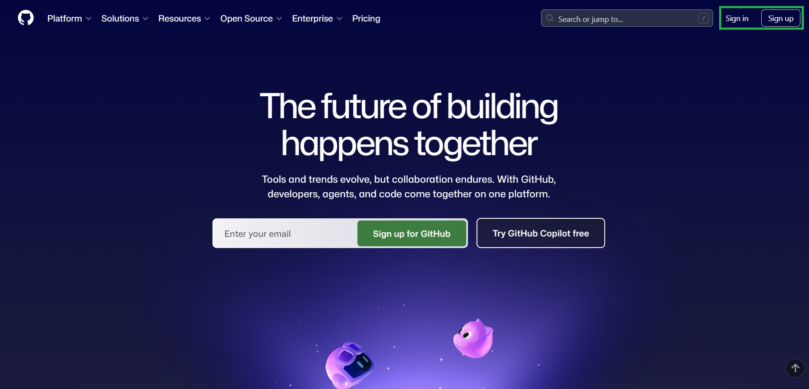
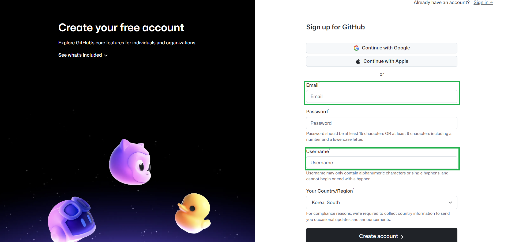

# Git Settings
Git 처음 배우는 사람을 위해....(사실 본인도 잘 몰라요... 안까먹으려고 작성한 문서)

## 1. Github 회원가입 / 로그인
1. https://github.com 접속 (이걸 보고 있다면 이미 접속했겠지만......)
2. 계정이 없다면 'Sign up'으로 회원가입, 있다면 Sign in'으로 로그인

|||
|---|---|

3. Username과 Email은 기억하세요. 나중에 쓰입니다.


## 2. Git 설치
### PS(PowerShell) 버전(Windows)

PowerShell이 없는 경우 Microsoft Store 앱에서 다운받아서 설치할 수 있습니다.

winget을 이용하여 설치해보겠습니다.

1. 우선 winget이 이미 있는지 확인

``` powershell
winget --version
```

아래 형식이 나오면 설치된 것.

    v0.00.000

만약 없다면

``` powershell
Invoke-WebRequest -Uri "https://aka.ms/Microsoft.DesktopAppInstaller_8wekyb3d8bbwe.msixbundle" -OutFile "$env:TEMP\AppInstaller.msixbundle"
Add-AppxPackage -Path "$env:TEMP\AppInstaller.msixbundle"
```

실행 후 ps 종료 후 재시작. 

2. 설치 시작

``` powershell
winget install --id Git.Git -e --source winget
```

설치가 제대로 되었는지 확인해봅시다.

``` powershell
git --version
```

버전이 나타나면 설치성공.

3. 사용자 정보 설정

아래 명령어를 입력합니다. "" 안에 있는 내용은 본인이 원하는대로 쓰시면 됩니다.

자유롭게 입력하셔도 무방합니다만 되도록이면 본인의 github 계정에 맞게 쓰시는 걸 권장드립니다.

``` powershell
git config --global user.name "당신의 닉네임"
git config --global user.email "당신의 이메일(xxxx@xxxxx.com 형식)"
```

아래 명령어로 확인

``` powershell
git config user.name
git config user.email
```

## 3. Repository(레포지토리) 생성
Repository(레포지토리)란?

그냥 간단히 Git 저장소에 올릴 대표 저장 폴더 정도로 생각하면 됩니다.

github.com에서 직접 추가해도 되지만

터미널을 이용해서 추가해 볼 예정입니다.

### Github-CLI 설치
터미널에서 작업을 하기 위해선 먼저 Github-CLI를 설치해야합니다.

그 전에 레포지토리로 사용할 폴더를 만들어주세요.

여기선 'MyProject'로 해보겠습니다.


``` powershell
# 현재 경로 아래에 MyProject 생성
mkdir MyProject

# 해당 폴더로 이동
cd MyProject

# git 연결
git init
```

이제 본격적으로 설치해봅시다.

``` powershell
# GitHub CLI 설치 (처음 설치 시)
winget install GitHub.cli

# 로그인
gh auth login

# 새 레포지토리 생성
gh repo create MyProject --public --source=. --remote=origin
```
