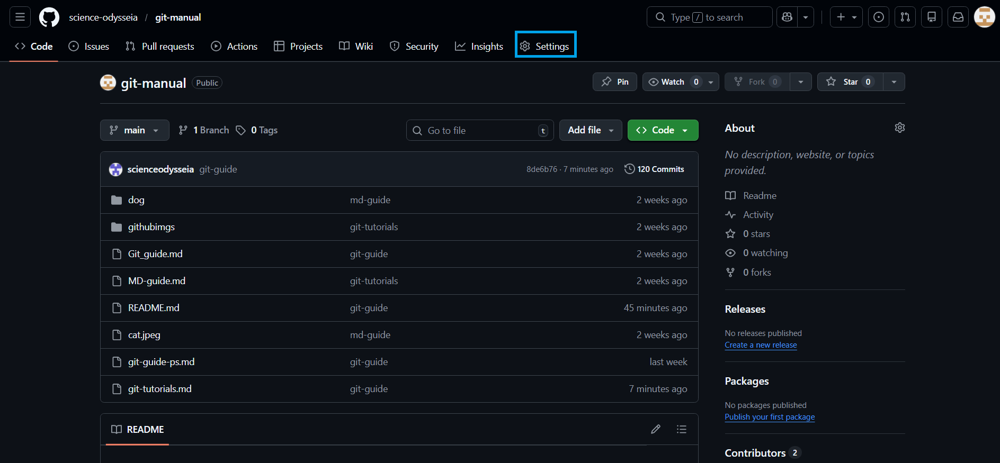
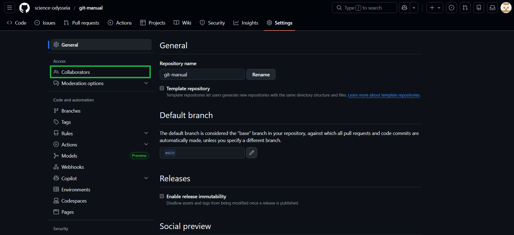
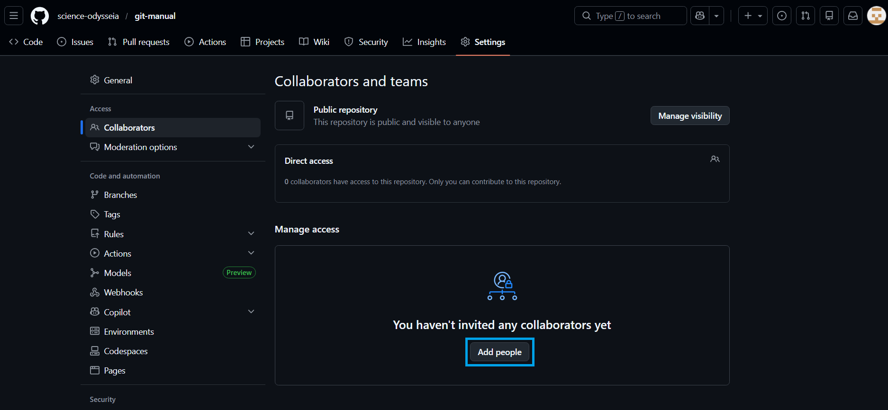
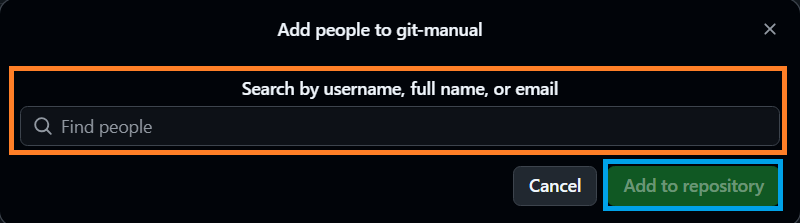

# Git-TuTorials

README.md 과정이 완료되었다면

`MyProject`라는 텅 빈 레포지토리까지 생성되었을 것입니다.

이제 내용을 채워봅시다.

<details>
<summary> <h2> 0. 사전준비 </h2> </summary>


## 준비사항

### 1. 먼저 내 컴퓨터의 작업경로가 레포지토리 만들 때의 작업경로로 되어 있어야 합니다.

내 컴퓨터의 `MyProject`(내 컴퓨터에 있는)로 레포지토리 `MyProject`(Git에 있는)을 만들었으니

현재 작업 경로를 `MyProject`(내 컴퓨터에 있는)로 이동하시면 됩니다.

### 2. 그리고 git을 시작해주세요.

``` bash
git init
```

\#\# 참고 : git 시작 후 git을 해제하는 방법

``` bash
rm -rf .git
```

</details>

<details>
<summary> <h2> 1. 업로드 명령어 3종 </h2> </summary>

------------------------------------------------------------------------------------
## Git 업로드 명령어 3종

먼저 Git에 업로드하는 3가지 필수 명령어입니다.

``` bash
git add "파일"
git commit -m "커멘트"
git push "옵션" "원격저장소 별명" "브랜치"
```

이 3가지를 모두 해줘야 업로드가 됩니다.

다만 이 경우는 이전에 업로드를 해줬던 적이 있을 때 사용하는 3단 명령어이며,

**새로운 레포지토리를 만들고 첫 업로드(푸시)를 하는 경우에는 아래와 같이 명령어를 사용합니다.**

```bash
git remote add "원격저장소 별명" git@github.com:"사용자 닉네임"/"레포지토리 이름".git
git add "파일"
git commit -m "커멘트"
git push "옵션" "원격저장소" "브랜치"
```

------------------------------------------------------------------------

``` bash
git remote add "원격저장소 별명" git@github.com:"사용자 닉네임"/"레포지토리 이름".git
```

원격저장소와 로컬저장소를 처음 연결할 때 사용하는 명령어입니다.

------------------------------------------------------------------------

``` bash
git add "파일 또는 폴더"
``` 

`git add .`, `git add README.md` 이런식으로 쓰이며

`git add README.md`를 예시로 들어보면

    원격저장소에 README.md 파일을 업로드할 준비를 하겠다

정도로 이해하시면 될 것 같습니다.

**준비** 이기 때문에, **실제로 업로드되진 않습니다.**

파일 대신 폴더나 디렉토리가 들어갈 수도 있습니다.

대표적으로 `git add .` 는 `.`가 현재 디렉토리를 의미하기 때문에

현재 디렉토리를 업로드 준비시키겠다 이런 의미입니다.

----------------------------------------------------------------------------------

``` bash
git commit -m "커멘트"
```

업로드하기 전 커멘트를 작성하는 과정입니다. 간략한 멘트 정도 남긴다 생각하시면 됩니다.

정확하게는 변경된 내용을 로컬 저장소에 기록하면서 커밋 메시지를 남기는 과정입니다.

**주의할 점은 저 명령어를 실행할 때 "커멘트"란을 공란으로 둘 경우 에러가 발생합니다.**

반드시 입력해주세요.

**또한 아무 변경내용 없이 커밋할 경우에도 에러가 발생합니다.**

--------------------------------------------------------------------------------

``` bash
git push "옵션" "원격저장소 별명" "브랜치"
```

아까 준비시킨 `git add "파일"`을 본격적으로 업로드시키는 명령어입니다.

주로 아래와 같이 사용합니다.

``` bash
git push
git push -u origin main
```

<br>

``` bash
git push -u origin main
```

첫 푸시할때 또는 원격저장소나 브랜치를 바꿔서 푸시하고 싶을 때 사용합니다.

이후 아래 명령어로 간단하게 푸시할 수 있습니다.

``` bash
git push
```

`-u` , `--set-upstream`:

upstream 설정으로 이를 이용에 첫 푸시를 한 경우 이후에는 `git push`로 간단하게 동일하게 푸시할 수 있습니다.

"원격저장소 별명", "브랜치 이름"만 계속 넣어준다면 없어도 상관없는 옵션입니다.

브랜치가 무엇인지는 뒤에서 설명하겠습니다.

정리하면

|명령어|의미|
|---|---|
|git init|git 실행|
|git remote add|"원격저장소"에 로컬을 연결시키는 작업|
|git add|업로드 파일 준비|
|git commit -m|커멘트|
|git push|업로드|

</details>

<details>

<summary> <h2 >2. 다운로드 명령어 </h2> </summary>

----------------------------------------------------------------------
## 클론(clone)과 풀(pull)

`clone`과 `pull`은 파일이나 디렉토리를 원격저장소에서 다운받는 2가지 명령어입니다.

`clone`은 아래처럼 주로 사용합니다.

``` bash
git clone git@github.com:"사용자닉네임"/"레포지토리이름".git
```

위 명령어를 실행하면 현재 내 디렉토리 위치 아래에 git에 있던 파일이 받아집니다.

`pull`은 아래처럼 주로 사용합니다.

``` bash
git pull origin main
```

----------------------------------------------------------------------
## 클론(clone)과 풀(pull)의 차이점
git에 파일을 업로드할 때에는 파일 내용 뿐만 아니라 변경 기록들도 같이 올라갑니다.

이를 히스토리 라고 하는데요.

문제는 내 로컬의 히스토리와 Git의 히스토리가 일치하지 않는 경우가 있다는 것입니다.

주로 여러 사람들이 협업 할 때 발생하는 경우입니다.

아래 예시를 살펴봅시다.

``` python
# example.py
print("Hello")
print("Git_Repository")
```

이라는 `example.py` 파일이 원격저장소에 있다고 해봅시다.

하지만 내 로컬 저장소에서 `example.py`가 아래와 같은 내용으로 있다고 해봅시다.

``` python
# example.py
print("Hello")
print("Local_files")
```

이 상황에서 Git에 있는 `example.py`를 내려받는다고 해봅시다.

그럼 내 컴퓨터에 있는 `example.py`는 어떻게 될까요?

여기서 `clone`과 `pull`의 차이점이 드러납니다.

`clone`은 내 로컬과 상관없이 원격저장소의 내용을 내 로컬에 덮어씌웁니다.

지우고 처음부터 새로 다시 쓴다고 생각하시면 됩니다.

``` python
# example.py
print("Hello")
print("Git_Repository")             ## print("Local_files")가 사라지고 원격저장소의 내용으로 덮임.
```

`pull`은 충돌이 일어나면 에러를 발생시키며 알려줍니다.

`pull`을 사용하여 에러 없이 원격저장소의 내용을 반영하면서 내 변경내용을 올리고 싶다면

뒤에 `--rebase`라는 옵션을 붙여줍니다.

``` bash
git pull origin main --rebase
```

이 명령어는 원격저장소의 내용을 먼저 반영한 후, 그 뒤에 내 변경내용을 반영하는 방식입니다.

즉 `example.py`는 아래와 같이 변경됩니다.

``` python
# example.py
print("Hello")
print("Git_Repository")             ## 원격저장소 내용 먼저 반영
print("Local_files")                ## 이후 내 로컬 변경내용 반영
```

물론 코드가 복잡하여 원격저장소와 내 코드의 내용이 많이 차이가 나는 경우 `--rebase`옵션을 사용하면 엄청 꼬일 수 있습니다.

이 경우 중단을 원하면 아래 명령어로 `--rebase` 시작 전으로 되돌릴 수 있습니다.

``` bash
git rebase --abort
```

\#\# 참고 : 강제 푸시

내 코드가 정답이다 할 때 강제로 내 코드로 업로드하는 방법

`-f` 또는 `--force` 옵션을 사용해서 푸시하면 됩니다.

~~팀원한테 욕먹을 각오하고 사용하시면 됩니다~~

``` bash
git push origin main -f
```

</details>


<details>

<summary> <h2> 3. 협업자 초대 </h2> </summary>

----------------------------------------------------------------------
## 협업자 초대하기(Collaborator)

내가 만든 레포지토리에 다른 사람이 작업할 수 있게 하려면

먼저 그 사람의 계정을 내 레포지토리에 초대해야 합니다.

<details>

<summary> <h3> 1. 웹에서 초대하는 방법 </h3> </summary>

[Github](https://github.com) 에서 하는방법

1. [Github](https://github.com) 에서 자신의 레포지토리에 들어갑니다.

2. `Settings`에 들어갑니다.



3. 왼쪽 목록의 `Collaborators`를 눌러주세요.



4. `Add People`을 누르고, 등록할 사람의 username 또는 이메일을 입력한 후 `Add to Repository`를 눌러 추가하면 됩니다.





</details>

<details>

<summary> <h3> 2. 터미널로 초대하는 방법 </h3> </summary>

터미널을 이용해서 초대할 수도 있습니다. 단, `username`으로만 가능합니다.(이메일 불가)

``` bash
gh api -X PUT /repos/"레포지토리 소유자"/"레포지토리 이름"/collaborators/"추가할 사람의 username"
```

</details>

</details>

<details>

<summary> <h2> 4. 브랜치 </h2> </summary>

----------------------------------------------------------------------
## 브랜치(branch)

branch는 직역하면 나뭇가지라는 의미입니다.

협업을 하다 보면 여러 사람이 동시에 같은 프로젝트를 수정하게 됩니다.

이때 모두가 같은 파일을 바로 수정하면 코드가 서로 충돌하거나 문제가 생길 수 있습니다.

그래서 Git에서는 나무의 가지처럼 작업 공간을 나누는 기능을 제공합니다.

각 사람은 자신의 **branch(가지)**에서 자유롭게 작업하고, 작업이 완료되면 나중에 이를 하나로 합칠 수 있습니다.

즉, branch는 프로젝트에서 독립적으로 작업할 수 있도록 나누어 놓은 작업 공간이라고 이해하면 됩니다.

~~사실 회사를 안다녀봐서 잘 모르겠...크흠~~

[Branch.png](githubimgs/branch.png)

여기까지 무슨말인지 잘 감이 안 오실 겁니다.

아래 예시들을 하나하나 해보시면

조금 이해가 되실 거에요

### 브랜치 생성

아래 명령어는 브랜치를 만드는 명령어입니다.

``` bash
git branch "브랜치 이름"
```


</details>


